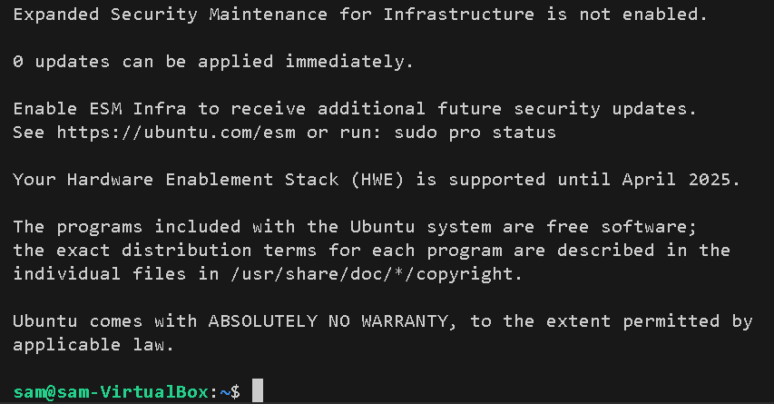

## 🔐 Phase 2: Linux Hardening and Monitoring (Ubuntu 20.04)

This phase focuses on hardening the Ubuntu VM to secure remote access, monitor user activity, and apply baseline protections suitable for production and enterprise settings.

### 🖥️ VirtualBox Setup (on Local Machine)
- Download and install **Ubuntu 20.04 Desktop ISO**
- Create a VirtualBox VM with at least 2 GB RAM, 2 CPUs
- Install **Guest Additions** for better integration (shared clipboard, resolution scaling, etc.)

### 1. 🔑 SSH Hardening

### 🔹 Step 1: Generate an SSH Key Pair  
**🖥️ On Local Machine:**

```
ssh-keygen -t rsa -b 4096 -C "your_email@example.com"
```

- Saves keys to `~/.ssh/id_rsa` and `~/.ssh/id_rsa.pub`

### 🔹 Step 2: Copy the Public Key to the VM  
**🖥️ On Local Machine:**

```
cat ~/.ssh/id_rsa.pub
```

**🖥️ On VM Console:**

```
sudo mkdir -p /home/ubuntu/.ssh
sudo nano /home/ubuntu/.ssh/authorized_keys
```

- Paste the public key into the file
- Then run:

```
sudo chmod 700 /home/ubuntu/.ssh
sudo chmod 600 /home/ubuntu/.ssh/authorized_keys
sudo chown -R ubuntu:ubuntu /home/ubuntu/.ssh
```

### 🔹 Step 3: Test SSH Access  
**🖥️ On Local Machine:**

```
ssh -i ~/.ssh/id_rsa ubuntuuser@<vm-ip>
```

### If you are unable to SSH from your local machine: 
### Switch to Bridged Adapter (Easiest & Best for Labs)
- This puts your VM on the same local network as your host, so you can SSH directly.
### 🔧 Steps:
- Shut down your VM completely (not just pause).
- In VirtualBox:
  - Select your VM → Click Settings
  - Go to Network → Adapter 1
  - Change "Attached to" from NAT → ✅ Bridged Adapter
  - Choose your actual network adapter from the dropdown (e.g., Wi-Fi or Ethernet)
  - Click OK.
  - Start your VM.

- In your VM run: 
```
ip a
```

- Then on your local machine try to SSH again: 
```
ssh -i ~/.ssh/id_rsa ubuntuuser@<vm-ip>
```

### Seeing port 22: Connection refused: 
- Check if Ubuntu VM terminal has SSH installed: 
```
which sshd
``` 
- If it return nothing, install SSH
```
sudo apt update
sudo apt install openssh-server -y
sudo systemctl enable ssh
sudo systemctl start ssh
```

<p align="center">
  
</p>

<p align="center">
  
</p>

### 🔹 Step 4: Disable Root Login and Password Authentication  
**🖥️ On VM:**

```
sudo nano /etc/ssh/sshd_config
```

Update the following lines:

```
PermitRootLogin no
PasswordAuthentication no
```

<p align="center">
  
</p>

<p align="center">
  
</p>


Restart the SSH service:

```
sudo systemctl restart ssh
```

### 🔹 Step 5: Add a Secure Sudo User  
**🖥️ On VM:**

```
sudo adduser admin
sudo usermod -aG sudo admin
```

<p align="center">
  
</p>

**🖥️ Back on Local Machine:**

Copy your public key again:

```
cat ~/.ssh/id_rsa.pub
```

**🖥️ On VM:**

```
sudo mkdir -p /home/admin/.ssh
sudo nano /home/admin/.ssh/authorized_keys
```

- Paste the key
- Set permissions:

```
sudo chmod 700 /home/admin/.ssh
sudo chmod 600 /home/admin/.ssh/authorized_keys
sudo chown -R admin:admin /home/admin/.ssh
```

### 🔹 Summary: SSH Hardening

| Location        | Task                                                             |
|----------------|------------------------------------------------------------------|
| Local Machine  | Generate key pair, test SSH access                               |
| VM             | Paste public key, disable root/password login, create admin user |

### 2. 🔥 UFW Firewall Configuration  
**🖥️ On VM:**

```
sudo ufw default deny incoming
sudo ufw default allow outgoing
sudo ufw allow ssh
sudo ufw enable
sudo ufw status verbose
```

<p align="center">
  
</p>


### 3. 🛡️ Fail2Ban for Intrusion Prevention  
**🖥️ On VM:**

```
sudo apt install fail2ban -y
sudo cp /etc/fail2ban/jail.conf /etc/fail2ban/jail.local
sudo nano /etc/fail2ban/jail.local
```

<p align="center">
  
</p>

Enable SSH protection by adding:
- Create a local config copy: 
```
sudo cp /etc/fail2ban/jail.conf /etc/fail2ban/jail.local
```
- Edit the Jail Configuration: 
```
sudo nano /etc/fail2ban/jail.local
```

- Scroll down and edit it to look like this:
```
[sshd]
enabled = true
port = ssh
logpath = %(sshd_log)s
```

Restart and verify:

```
sudo systemctl restart fail2ban
sudo fail2ban-client status sshd
```

Expected output should look like this: 
<p align="center">
  
</p>


### 4. 🔄 Unattended Security Updates  
**🖥️ On VM:**

```
sudo apt install unattended-upgrades -y
sudo dpkg-reconfigure --priority=low unattended-upgrades
```

### 5. 📊 Enable Auditd for System Logging  
**🖥️ On VM:**

```
sudo apt install auditd audispd-plugins -y
sudo systemctl enable auditd --now
sudo ausearch -m USER_LOGIN
```

<p align="center">
  
</p>

### 6. 📬 Install Logwatch for Daily Reports  
**🖥️ On VM:**

```
sudo apt install logwatch -y
sudo logwatch --detail high --mailto samantha@example.com --range today --service sshd --format html
```

> 💡 You may need to install `mailutils` or configure Postfix to enable email delivery.

<p align="center">
  
</p>


### ✅ Summary Table

| Component           | Security Improvement                     |
|---------------------|------------------------------------------|
| SSH                 | Key-based login, no root/password login  |
| UFW                 | Deny-all-by-default firewall             |
| Fail2Ban            | Blocks brute-force attempts on SSH       |
| Unattended Upgrades | Automatic patching of security packages  |
| Auditd              | Captures login and system event auditing |
| Logwatch            | Generates daily email log summaries      |

> 📦 Next: Phase 3 will harden the **Windows Server** and apply enterprise-grade security policies via GPOs and auditing tools.
