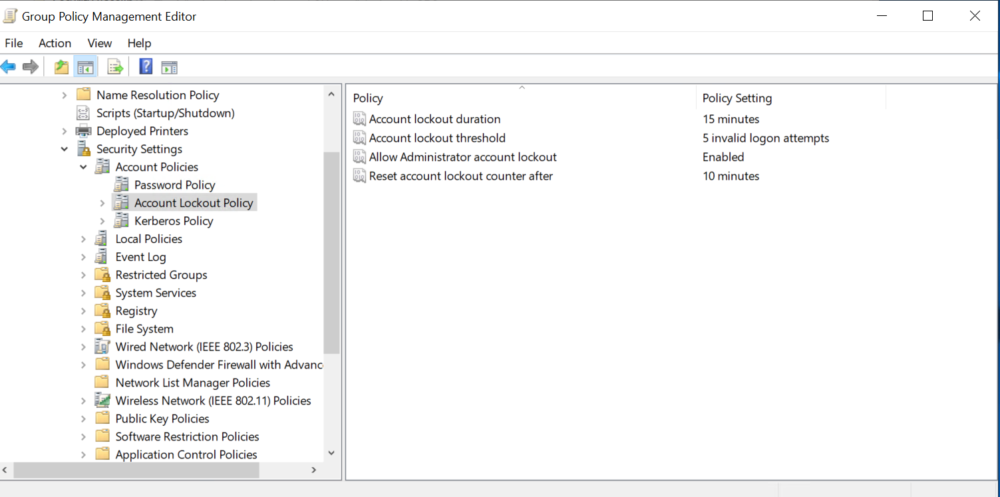
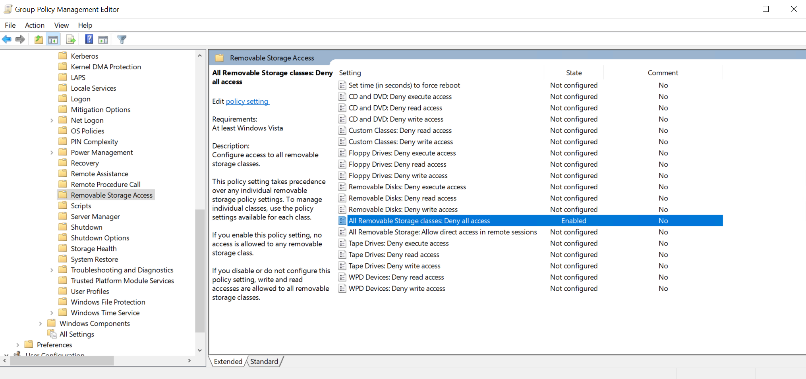

## 🪟 Phase 3: Windows Server Hardening and Monitoring (EC2 - Server 2019)

In this phase, you'll configure Windows Server 2019 with domain controller functionality, apply Group Policy Objects (GPOs), enforce audit policies, and deploy basic hardening measures to simulate enterprise security baselines.

### 1. ⚙️ Promote Server to Domain Controller

### Install AD DS Role

Open PowerShell as Administrator:

```
Install-WindowsFeature AD-Domain-Services
```
<p align="center">
  
</p>

### Promote to Domain Controller:

```
Import-Module ADDSDeployment

Install-ADDSForest `
  -DomainName "corp.local" `
  -CreateDnsDelegation:$false `
  -DatabasePath "C:\Windows\NTDS" `
  -DomainMode "WinThreshold" `
  -DomainNetbiosName "CORP" `
  -ForestMode "WinThreshold" `
  -InstallDns:$true `
  -LogPath "C:\Windows\NTDS" `
  -NoRebootOnCompletion:$false `
  -SysvolPath "C:\Windows\SYSVOL" `
  -Force:$true

```
<p align="center">
  
</p>

> After reboot, log in with the domain admin account: `CORP\Administrator`

<p align="center">
  
</p>

### 2. 👤 Create OUs, Users, and Groups

Make sure to install RSAT Tools if needed

<p align="center">
  
</p>

<p align="center">
  
</p>

Open **Active Directory Users and Computers**:

* Create OUs like `Workstations`, `Admins`, `Users`
* Create sample users (`testuser1`, `admin1`) and assign to groups

<p align="center">
  
</p>

<p align="center">
  
</p>

### 3. 🛡️ Group Policy Configuration

Create and link a new GPO in Group Policy Management

<p align="center">
  
</p>

Launch **Group Policy Management** (`gpmc.msc`) and apply the following policies:

### ✅ Enforce Password Policy:

* Minimum length: 12
* Complexity requirements: Enabled
* Expiration: 60 days

With group polocy management open: 
- Forest > Domains > corp.local > Right-click Default Domain Policy → Click Edit

<p align="center">
  
</p>

Navigate to: 
```
Computer Configuration
  └── Policies
      └── Windows Settings
          └── Security Settings
              └── Account Policies
                  └── Password Policy
```
<p align="center">
  
</p>

### ✅ Lockout Policy:

* Threshold: 5 attempts
* Duration: 15 minutes

<p align="center">
  
</p>

### ✅ Restrict RDP and Access:

* Enable session timeout
* Deny removable storage via GPO

Navigate to: 
```
Computer Configuration
  └── Policies
      └── Administrative Templates
          └── Windows Components
              └── Remote Desktop Services
                  └── Remote Desktop Session Host
                      └── Session Time Limits
```

<p align="center">
  
</p>


Navigate to: 
```
Computer Configuration
  └── Policies
      └── Administrative Templates
          └── System
              └── Removable Storage Access
```

<p align="center">
  
</p>

### ✅ Auto Screen Lock:

* Screen saver timeout: 5 minutes
* Password-protect on resume

Navigate to: 
```
User Configuration
 └── Policies
     └── Administrative Templates
         └── Control Panel
             └── Personalization
```

<p align="center">
  
</p>

### 4. 📝 Enable Windows Audit Policy

Go to `Local Security Policy > Advanced Audit Policy Configuration`:

* Logon/Logoff events
<p align="center">
  
</p>
<p align="center">
  
</p>


* Object access and Account management
- Go to `Local Policies > Audit Policy > Audit object access`:
<p align="center">
  
</p>

<p align="center">
  
</p>

Use `Event Viewer` to review logs:

```
Get-WinEvent -LogName Security | Format-List -Property *
```

### 5. 🔥 Enable Windows Defender & Configure Firewall

### Windows Defender:

```
Get-MpPreference
Update-MpSignature
Start-MpScan -ScanType FullScan
```

### Configure Firewall:

Use `Windows Defender Firewall with Advanced Security` to:

* Deny inbound by default
* Allow RDP (if limited by IP)

<p align="center">
  
</p>


### ✅ Summary

| Component        | Configuration Applied                       |
| ---------------- | ------------------------------------------- |
| Active Directory | Domain controller, OUs, test users/groups   |
| GPOs             | Password, lockout, removable media policies |
| Audit Policy     | Login, user changes, access events logged   |
| Windows Defender | Enabled + updated signatures + full scan    |
| Firewall         | Rules set to restrict access                |

> ✅ Your Windows Server is now hardened and ready for centralized monitoring or integration into a broader security lab setup.
